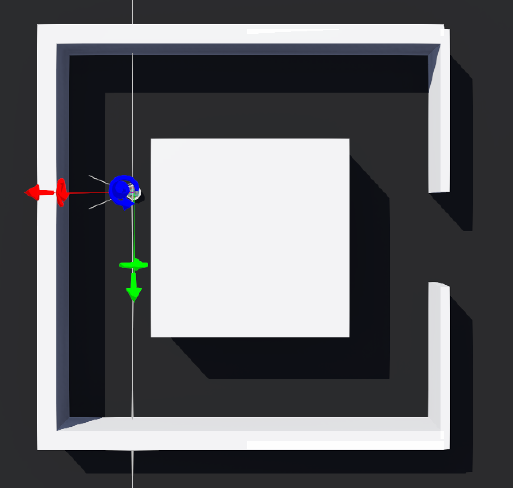
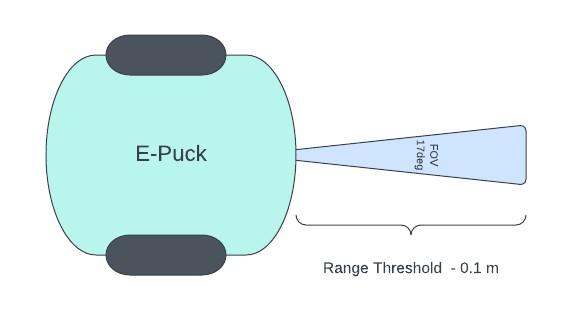
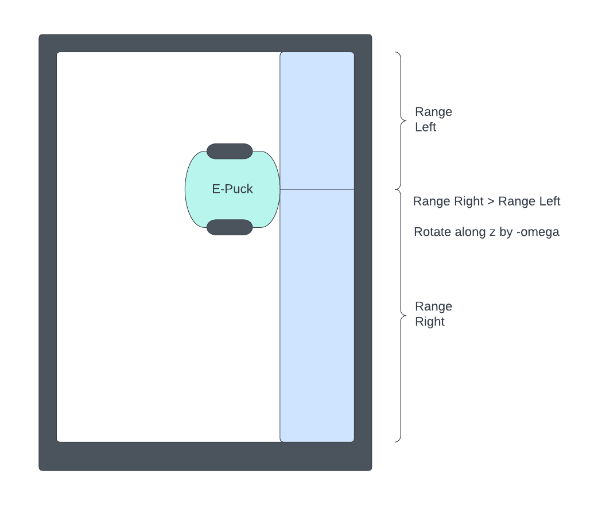
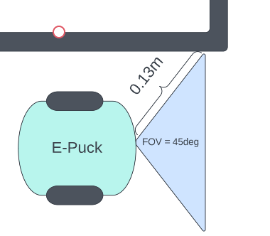
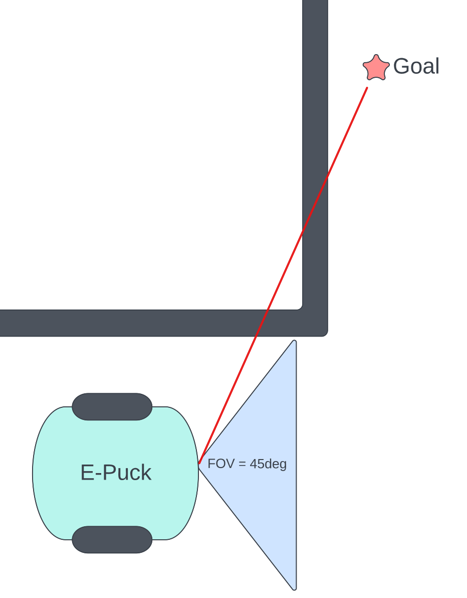
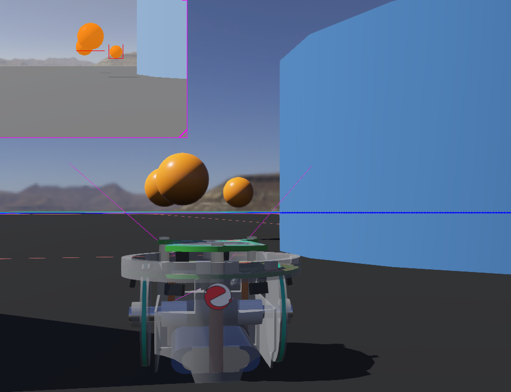

# Localisation and Maze Navigation

Author : [Srujan Gowdru Lingaraju](mailto:gowdr002@umn.edu)

<video src="images/Epuck_Maze_Navigation.mp4" controls title="Title" style = "width: 50%; height: 50%;" ></video>

## World Setup

Webots Simulation environment is set up with the practice virtual environment. The landmarks for localization are the orange [RGB: 1,0.54,0.08] spherical balls. For this implementation I have considered a total of 10 landmarks, equally distributed between the upper and lower hemispheres of the cylindrical obstacle. The key concepts used for this project are Robot Localization using global landmark coordinates and Extended Kalman Filter for State Propagation and Update (SLAM - Localization in a known environment), Navigation of the robot using Lidar data inside the maze and bearing angles of the landmarks outside of the maze. The Camera is enabled for landmark recognition with the same RGB values as of the landmarks. The Lidar is configured for 1Layer, with a FOV of 180deg and a range of 3m.

   

## Experiment Setup

The robot is placed in the left half of the Left maze with XYcoordinates [-2.77, 0.25] with an initial orientation of 3.14159 with respect to the world coordinates. The Final goal Coordinates for this submission are [2.86, -0.12] which is on the right half of the right maze.

The Landmark objects are modified to float at a distance of 0.1m along the z axis. This is achieved by removing the physics attribute of the landmarks.

   

## Implementation:

The script execution starts by initializing the Goal coordinates and the rest of the constants such as the wheelRadius and the axle length of the e-Puck robot, EKF Update frequency etc.

Two class objects myPuck and myPuck\_EKF of classes EPuck and EKF are instantiated. These class objects contain methods to perform tasks specific to those class objects. The functionalities of these methods are explained in the remainder of this report. Moving forward, the robot is initialized and its starting Pose is updated to the initial pose vector of the myPuck object.

## Navigation:

- Inside the maze
- The first command for the robot is to orient itself towards the goal. This is accomplished by calculating the bearing angle and giving a constant angular velocity until the bearing angle is less than 1 deg.
- Move towards the goal until the obstacle is detected

   

- Rotate the robot in the direction of highest range measurements

   

- Constantly check for ranges at -45 deg and +45 degrees to avoid colliding when turning

   

- Consistently check for lidar range along the bearing angle, if its greater than 0.2m, rotate along the direction of the bearing until it is close to zero while moving towards the goal

   

- Outside the Maze
- If the Landmarks are detected, calculate the bearing angle, move towards the landmark with highest bearing angle

   

The Algorithm flow is explained briefly as follows.

1. Update the input vector “u” with angular and linear velocities
2. Call EKF Propagate method from EKF Class for State Propagation
3. Use the updated state to calculate the Robot pose by calling the update\_pose method from the EPuck class.
4. Use the Affine Transformation matrix R\_T\_G to calculate the goal coordinates with respect to the robot's frame of reference while also calculating the bearing angle to the goal.
5. Use the Lidar range measurements and set the “inf” values to max range (3m)
6. If the landmarks are detected - Update the state vector using relative position measurements from the landmarks to the robot and update the error covariance matrix.
7. Call the epuck\_controller method from the EPuck class to decide the navigation path.
8. Calculate the left and right wheel velocities from the angular and linear velocities.
9. Move the robot
10. Calculate the distance of the robot to goal (Stop Robot if the distance is below a threshold of 0.1m

### EPuck Class methods:

- `def set_goal(self, goal):`

Takes numpy array of size two containing the global goal coordinates and sets the class attribute self.G\_goal

- `def rotMat(self, theta):`

Takes rotation angle in rad along the z-axis and returns a 3X3 rotation matrix

- `def update_pose(self, x_hat_t):`

Takes estimated state vector and updates the affine transformation matrixself.R\_T\_G

- `def get_dist(self, target_pos):`

Takes a numpy array of size 4X1 (Homogeneous representation) and returns the distance from robot to target position

- `def update_bearing(self):`

Transforms the goal from Global to robot’s frame of reference and updates the bearing angle self.bearing

- `def get_wheelSpeed(self, omega, lin_vel):`

Takes linear and angular velocities and returns left and right wheel velocities

- `def get_li_bearing(self):`

Clips the bearing angle to +90 deg or -90 degrees if the bearing angle is out of range (-90>bearing>+90)

- def epuck\_controller(self, ranges):
- Takes Lidar range measurements as input
- Checks if the robot is oriented towards the goal, if not, orients the robot towards the goal
- Checks for obstacles in a fov of 17 deg and a distance of 0.1m
- Checks for obstacles in a fov of deg and a distance of 0.2m and also obstacles along the bearing angle.
- Updates heading of the robot depending on the lidar ranges

### EPuck Class methods:

- def EKFPropagate(self, u, dt):
- Updates the state vector using the input vector u and updates propagation error covariance matrix
- def EKFRelPosUpdate(self, G\_p\_L, z):
- Updates the state vector using the range measurement and updates error covariance matrix when the landmarks are detected
<!-- 
xk+1|k= f (ˆxk|k, uk, 0)

Φk= ∇xkf (ˆxk|k, uk, 0)

Gk= ∇wkf (ˆxk|k, uk, 0)

Pk+1|k= ΦkPk|kΦTk+ GkQkGT -->

<!-- (Stregios notes) -->

<!-- 

zk+1|k= h(ˆxk+1|k)

rk+1|k= zk+1− ˆzk+1|k

Hk+1= ∇xk+1h(ˆxk+1|k)

Sk+1|k= Hk+1Pk+1|kHTk+1+ Rk+1

Kk+1|k= Pk+1|kHTk+1S−1k+1|k

ˆxk+1|k+1= ˆxk+1|k+ Kk+1|krk+1|k

Pk+1|k+1= Pk+1|k− Pk+1|kHTk+1S−1k+1|kHk+1Pk+1|k (Stregios notes)

 -->

`def lidar_out(li_ranges):`

- Checks for mean of the left and right ranges w.r.t robot and decides to rotate the robot in the direction of the greatest value
- Checks for ranges at -90 and +90 deg w.r.t robot, then decides to rotate the robot in the direction of the greatest value.

`def posOfImgToBearing(x):`

Uses the image pixels values of the landmark and converts it to bearing angle

Challenges:

- Clipping the bearing angle when the bearing is out of range
- Optimizing the range thresholds
- EKF localization and navigating when ranges are “INF”
- Finding the Angular and Linear velocity combination to avoid wheel velocities exceeding 6.28 rads/sec

Conclusion:

- If the std deviation of noise is above a certain value, before the robot detects the landmarks, error increases and the bearing angle deviates, this may cause unintended behavior.
